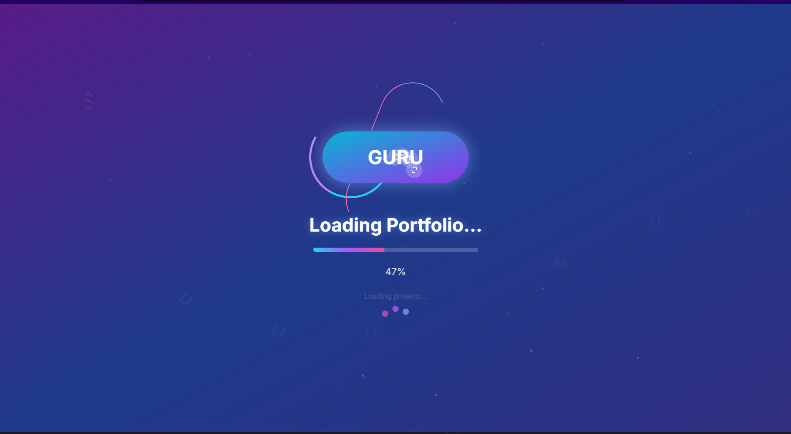
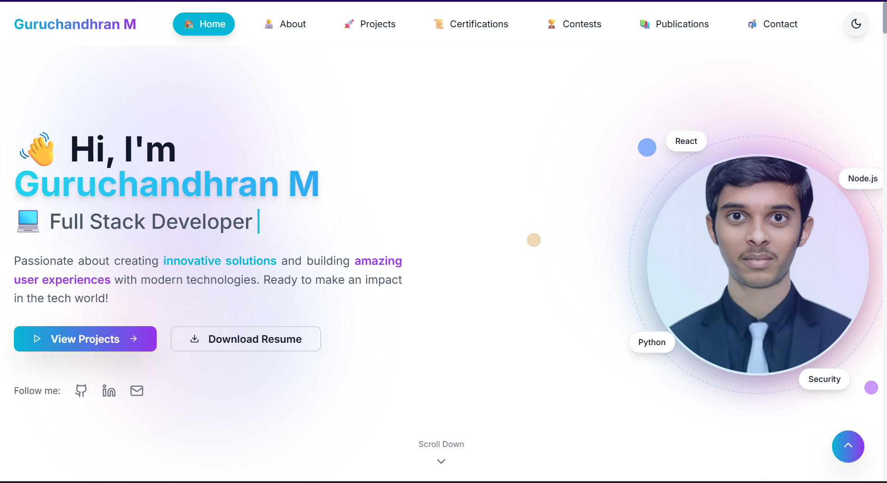
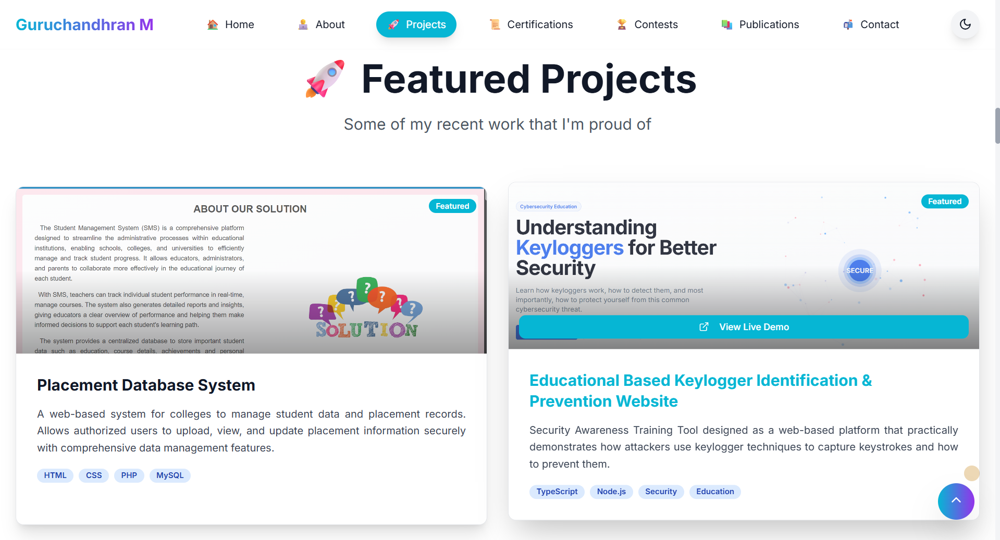
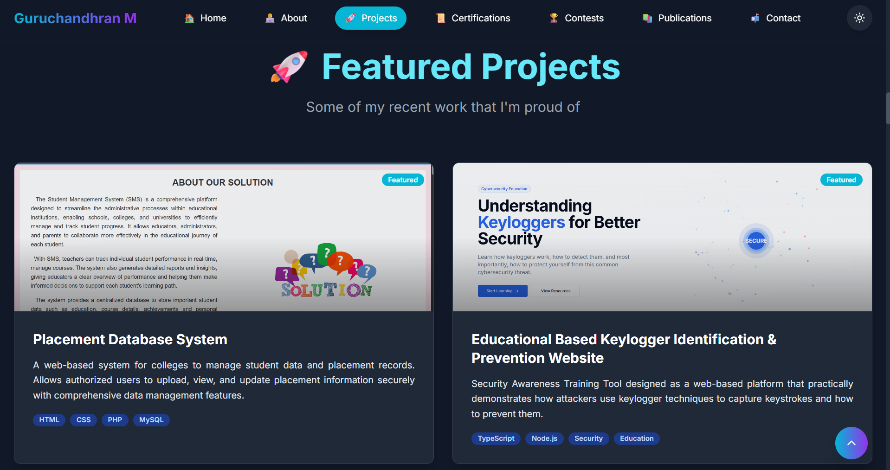
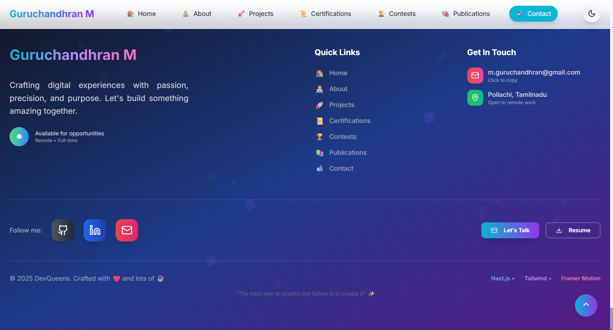

# Guru's Portfolio

Hi, I'm Guruchandhran — a passionate Technical Engineer focused on building innovative solutions and delightful user experiences. This portfolio showcases my projects, certifications, contests, leadership, achievements, publications, and ways to connect. I enjoy working across the stack, with a love for clean code, performance, and accessible, responsive interfaces.

- Location: Pollachi, Coimbatore, Tamilnadu
- Roles: Frontend Developer, Backend Developer, Full Stack Developer, 
- Email: m.guruchandhran@gmail.com
- GitHub: https://github.com/Guru-2609/
- LinkedIn: https://linkedin.com/in/guruchandhran-m/

---

## Table of Contents

- About the Project
- Features
- Contents (What’s inside)
  - Hero
  - About
  - Projects
  - Certifications
  - Contests (Hackathons, Events, Forage Simulations)
  - Leadership & Achievements
  - Publications
  - Contact
- Tech Stack
- Getting Started
- Project Structure
- Customization Guide
- Accessibility & Responsiveness
- Screenshots
- License

---

## About the Project

A modern, responsive, animated portfolio built with Next.js, Tailwind CSS, and Framer Motion. It includes a polished design, smooth transitions, dark mode, and interactive sections like contest tabs and certification modal. Content is structured in simple arrays for easy customization.

---

## Features

- Polished hero with animated typewriter roles and interactive background
- Global animated loading screen with progress indicator
- Sticky navigation with scroll spy and dark mode toggle
- Fully responsive layouts (desktop, tablet, mobile)
- High-quality animations using Framer Motion
- Color-coded, tabbed Contests section (single-row items with image + details)
- Certifications grid with a full-screen modal viewer
- Featured and other projects with tech badges, images, and external links
- Leadership & Achievements with thematic cards and hover effects
- Publications section with concise summaries and links
- Contact section with a form and verified social links
- Accessible components and semantic content
- Simple content structure — edit arrays to customize quickly

---

## Contents (What’s inside)

Below is a high-level overview of the core content included in this portfolio. All items can be updated in app/page.tsx.

### Hero
- Greeting with animated emoji and gradient name
- Typewriter for roles (Software Developer, Frontend Developer, Backend Developer, Web Developer, Full Stack Developer, React Developer)
- Call-to-actions: View Projects, Download Resume
- Social links: GitHub, LinkedIn, Email
- Interactive visuals and custom cursor

### About
- Intro card: Passionate Developer & Problem Solver
- Technologies & Skills with progress bars:
  - Python, Java, HTML, Node.js, MySQL, GitHub, VS Code, Linux, Windows, Networking, Security
- Education:
  - B.Tech in Information Technology, P. A. College of Engineering and TEchnology (2022–2026), CGPA 8.69/10, Relevant Coursework: Data Structures and Algorithms, Computer Networks, Object Oriented Programming, Database Management System
- Interests:
  - Software Development, Cybersecurity, Open Source, AI/ML, Networking

### Projects
- Featured Projects (with images and live demos):
  - Placement Database System — HTML, CSS, PHP, MySQL — Live: https://
  - Educational Keylogger Identification & Prevention — TypeScript, Node.js, Security, Education — Live: https://keylogger-prevention-demo.vercel.app
- Other Projects:
  - Network Monitoring System — Next.js, Node.js, Networking, Monitoring — Live: https://network-monitoring-demo.vercel.app
  - Keylogger Identification & Prevention — TypeScript, Security, Education, Cybersecurity — Live: https://keylogger-training-demo.vercel.app

### Certifications
A grid of certifications (top 4 on the page):
- 36 Hours Hackathon (MKCE) — 2025 
- Cyber Security & Privacy (NPTEL) — 2024
- Geo Data and Cyber Privcy (ISRO) — 2025
- Python for Beginners (EC Council) — 2024

And many more....

### Contests (Tabbed — single-row items with image + details)
Switch between categories: Hackathons, Events, Forage Simulations. Each entry is displayed horizontally (image left, content right) on larger screens and stacks on mobile.

- Hackathons
  - NAF Uzhavu Hackathon — IIT Madras — Chennai, Tamil Nadu — Jan 2025 — Finalist
    - Focused on agricultural tech with IoT sensors + ML to optimize crop yield
  - 36 Hours HackFest — M.Kumarasamy College of Engineering, Karur — Karur, Tamil Nadu — Mar 2025 — Participant
    - Built a real-time collaboration platform with video and project features
  - Seed Hackathon — Seed Global Education — Online — Nov 2024 — Participant
    - Built an AI-powered personalized learning assistant

- Events
  - Code Vault — Dept of CSE — College Campus — Oct 2024 — Participant
  - Code Warriors — Engiversee — Online — Dec 2024 — Participant
  - Cyber Security Bootcamp — Novitech — Hybrid — Dec 2024 — Completed

- Forage Simulations
  - Cybersecurity Analyst Job Simulation — TCS by Forage — Online — May 2025 — Completed
  - Shields Up: Cybersecurity Job Simulation — AIG by Forage — Online — June 2025 — Completed

- Contest Summary Stats
  - Hackathons: 3
  - Events: 3
  - Simulations: 2
  - Total: 8

### Leadership & Achievements
- Leadership
  - Department Secretary — Computer Science Department — 2025-Present
  - Department Placement Coordinator — Career Services — 2023–Present
  - Events Technical Lead — Technical Symposium — 2023-Present
  - ISTE Member — Indian Society for Technical Education — 2022–Present
- Achievements
  - Finalist in NAF Uzhavu Hackathon — National Agriculture Foundation — 2024 — Top 10 Finalist
  - 1st Prize in Intra College Project Expo — College Technical Symposium — 2024 — First Place

### Publications
- A Novel Approach to Keylogger Identification — International Journal of Cybersecurity — 2025
- Enhancing Network Monitoring with AI — Journal of Network Engineering — 2025

### Contact
- Location: Pollachi, Coimbatore, Tamilnadu
- Email: m.guruchandhran@gmail.com
- GitHub: https://github.com/Guru-2609/
- LinkedIn: https://linkedin.com/in/guruchandhran-m/

---

## Tech Stack

- Framework: Next.js 15 (App Router), React 18, TypeScript
- Styling: Tailwind CSS 3, CSS variables, gradients, animations
- Animations: Framer Motion 11
- UI: shadcn/ui (Button, Card, Badge), class-variance-authority (CVA)
- Icons: lucide-react
- Utilities: clsx, tailwind-merge
- Images: next/image with placeholder assets
- Build tooling: PostCSS, Autoprefixer, ESLint, TypeScript

---

## Getting Started

Prerequisites:
- Node.js 18+
- pnpm, npm, or yarn

Install:
- pnpm install
- npm install
- yarn

Run dev server:
- pnpm dev
- npm run dev
- yarn dev

Build:
- pnpm build
- npm run build
- yarn build

Start production:
- pnpm start
- npm start
- yarn start

No environment variables are required to run this project.

---

## Project Structure

- app/layout.tsx — Global layout + metadata
- app/page.tsx — Main portfolio page (all sections and content arrays)
- app/globals.css — Tailwind base and custom styles (gradients, animations)
- components/ui/* — shadcn/ui components
- lib/utils.ts — cn utility (clsx + tailwind-merge)
- public/images/* — Reference and preview images
- tailwind.config.ts — Tailwind configuration
- postcss.config.js — PostCSS
- package.json — Dependencies and scripts

---

## Customization Guide

Most content is declared as arrays inside app/page.tsx. Update these to personalize:

- Personal information:
  - Name, social links, email, location (in hero and contact sections)
- Skills:
  - Edit the skills array to update names, levels, and categories
- Projects:
  - Update the projects array (title, description, tech, liveDemo, image, featured)
- Certifications:
  - Update the certifications array (title, issuer, date, id, logo, verified, description)
- Contests:
  - Hackathons, Events, Forage — update items for title, organizer, location, date, description, image, achievement
- Colors/Theming:
  - Tweak CSS variables in app/globals.css or Tailwind classes
- Animations:
  - Framer Motion props (duration, easing, whileHover, etc.)

Pro tip:
- Replace placeholder images (/placeholder.svg?...) with your real images in public/ and update the src paths.
- Keep alt text descriptive for accessibility.

---

## Accessibility & Responsiveness

- Responsive design at all breakpoints (mobile-first)
- Semantic headings and clear hierarchy
- Sufficient color contrast in dark and light modes
- Focused, non-intrusive animations (hover and in-view transitions)
- Tabbed Contests section:
  - Single-row layout (image + details) on larger screens
  - Gracefully stacks on mobile for readability

---

## Screenshots

### Loading Screen

### Hero Section

#### Light Mode

#### Dark Mode

### Reference

Use these as references to maintain or evolve visual polish.

---

## License

This project is provided as-is for personal portfolio use. If you plan to open-source it, consider adding an OSS license (e.g., MIT) and updating this section.

---

## Contact

If you have opportunities, feedback, or collaboration ideas:

- Email: m.guruchandhran@gmail.com
- GitHub: https://github.com/Guru-2609/
- LinkedIn: https://linkedin.com/in/guruchandhran-m/

Thank you for reviewing my portfolio!
